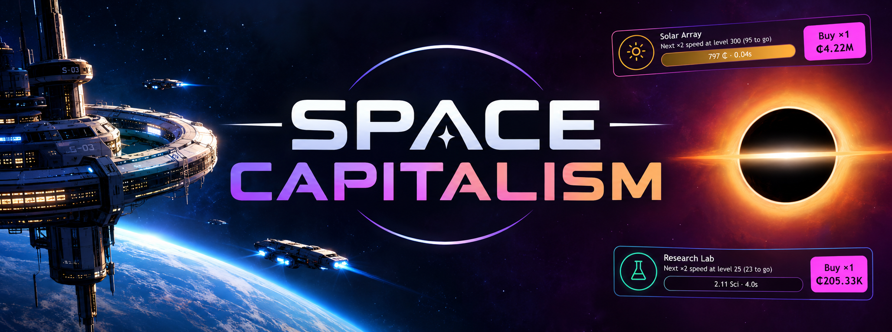

# Space Capitalism

A space-themed idle game that runs in your browser. Build fleets, hire crew, research new tech, warp for Dark Matter and, eventually, send your whole empire through a black hole.

It's inspired by *AdVenture Capitalist* and *AdVenture Communist*, merged into one game with no ads and no in-app purchases. It isn't affiliated with or endorsed by those games or their makers.

**Play it:** https://king-tulip999.github.io/Space-Capitalism/

## Features

- **30 fleets** that climb the tech ladder, from Solar Arrays and Lunar Mines to Dyson Swarms, Wormhole Relays and the Singularity Gate. Each one has its own crew and 10 upgrades.
- **Research Labs** produce Science, which you spend on 30 permanent research techs.
- **Warp** for Dark Matter, a permanent profit bonus, and spend it on Dark Matter upgrades.
- **Ascend** for Quasar Cores, a second prestige layer with its own upgrades.
- **The black hole:** build the Singularity Gate, charge it (with Gate amplifiers to speed it up) and cross the event horizon to finish the game. A full playthrough takes roughly 100+ hours.
- **36 missions and 78 achievements**, each adding permanent profit.
- **Bonuses:** a daily bonus worth six hours of income, and a power boost that triples your profit for 30 minutes and grows stronger with every Ascension.
- **Quality of life:** "buy all" and "hire all" buttons, a "Next ×2" buy mode, hints that tell you when to warp or ascend, red dots when missions or bonuses are ready, and number names up to Centillion (10³⁰³).
- **Offline earnings,** so your fleets keep working while you're away. A power boost only counts for the time it had left.
- **An 8-page tutorial** that explains every system, and can be reopened any time.
- **Phone-first design:** swipe left or right anywhere below the top boxes to change tabs (stars streak past as you go), or open the side menu from the button at the bottom left. The menu shows a short status for every tab, like how many missions are ready to claim, and the top stats are never covered. The page only scrolls up and down. There's also a theme color picker, a low-effects mode and full-screen home screen support.

## How to play

1. Tap anywhere on the title screen, then tap **Build** on the Solar Array. Tap the fleet's card to run it and earn credits. Swipe left or right to move between tabs, or tap the menu button at the bottom left.
2. Buy more fleets and levels. Every 25, 50, 100 and so on levels doubles a fleet's speed.
3. Hire **crew** so fleets run on their own, even while you're offline.
4. Spend credits on **upgrades** and Science on **research**. Claim **missions** for Science and bonus profit.
5. When the menu shows a red dot next to Warp, **warp** for Dark Matter. Later, **ascend** for Quasar Cores.
6. Build the **Singularity Gate**, charge it in the **Black Hole** tab, and cross the event horizon to finish.

## Add it to your iPhone home screen

1. Open the play link in **Safari**.
2. Tap **Share**, then **Add to Home Screen**.
3. Launch it from the new icon to play full screen.

## Saving

Progress saves automatically in your browser every few seconds. Saves are tied to the browser and address you play in, so clearing Safari's website data deletes your save.

To back up or move your progress, open the menu and tap **Settings**:

- **Export** gives you a save code, including your theme color. Keep it somewhere safe.
- **Import** loads a save code, for example on another device.

## Project details

- The whole game is a single `index.html` file: plain HTML, CSS and JavaScript with no frameworks, build step or external downloads.
- Game content (fleets, research, upgrades, missions, achievements) is plain data near the top of the script, and each upgrade's effect is written next to it, so adding one is a single line. Saves from earlier builds are converted automatically.
- Icons are hand-drawn inline SVGs, the black hole is an animated SVG, and the starfield and nebulas are drawn on a canvas.
- Game balance was tuned with an automated player that simulated full playthroughs, targeting the first warp at about 1.5 hours and a finish at about 100 hours of perfect, nonstop play.

To run it locally, download `index.html` and open it in any modern browser.

## Version

Current build: **Build 12**.
